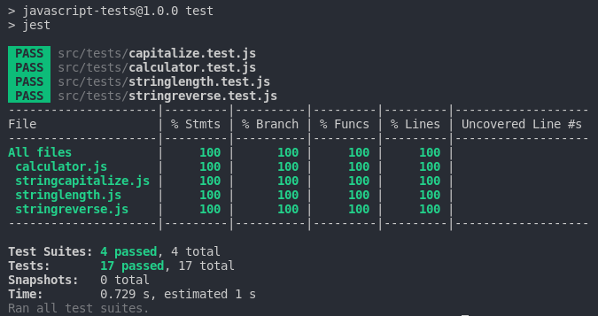

<p align="center">
  <a href="https://www.microverse.org/">
    
  </a>
  <a href="https://github.com/VanessaAoki/JavaScript-Tests/blob/main/LICENSE">
    
  </a>
  <a href="https://github.com/VanessaAoki/JavaScript-Tests">
    
  </a>
  <a href="https://github.com/VanessaAoki/JavaScript-Tests">
    
  </a>
  <a href="https://github.com/VanessaAoki">
    
  </a>
</p>

# JavaScript Tests

This is an exercise to apply practical tests for JavaScript functions using the Jest library, following the AAA pattern.



## Built With

- HTML, CSS, JavaScript, Jest & Webpack;
- Visual Studio, Git & GitHub;

## Getting Started

To run this project, you only need to follow these steps:

1. In your terminal, type the following, to clone this repository:

```sh
$ git clone git@github.com:VanessaAoki/JavaScript-Tests.git
```

2. After, run the following commands in your terminal:

```sh
$ cd JavaScript-Tests
npm install
npm test
```
<details align="right">
<summary><small>What are these commands?</summary>
- the `$ cd` command is used to move to different folders. <br>
- while `$ npm build` is used to compile the aplication files.
- lastly, `$ npm run test` is used to run the test files.</small>
</details>

## Author

👩🏼‍💻 **Vanessa Aoki**

- GitHub: [@VanessaAoki](https://github.com/VanessaAoki)
- Twitter: [@VanessaSAoki](https://twitter.com/VanessaSAoki)
- Linkedin: [Vanessa Aoki](https://www.linkedin.com/in/vanessasaoki/)

## 🤝 Contributing

Contributions, issues, and feature requests are welcome!

Feel free to check the [issues page](https://github.com/VanessaAoki/JavaScript-Tests/issues).

## Show your support

Give a ⭐️ if you like this project!

## 📝 License

This project is [MIT](./LICENSE) licensed.
